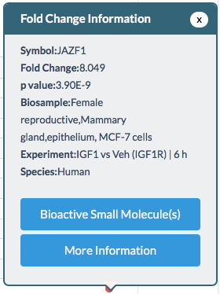
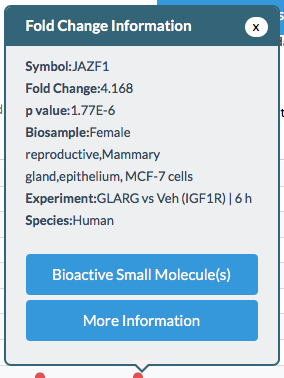
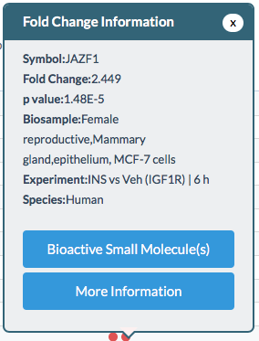
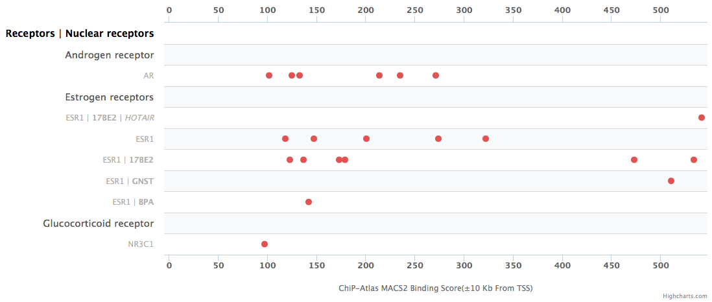

# Implications of SPP regulation reports for JAZF1 regulation

We are interested in studying JAZF1 regulation in adipose cells and skeletal
muscle cells. The following data illustrate our motivation:

## Association of SNPs with T2D risk and JAZF1 expression at the JAZF1 locus

The x-axis of this figure represents a genomic region of roughly 500 kilobases.
All points and bars in the first three plots represent SNPs. SNPs
that occupy skeletal muscle regulatory sites are colored according to the
legend.

From top to bottom, the subfigures are:

* Association with T2D risk (-log10 p-value)
* Association with JAZF1 expression in skeletal muscle tissue (-log10 p-value)
* Posterior probability of being the causal variant after bayesian fine-mapping (PPA)
* RefSeq transcript annotations

It is visually apparent (and statistically demonstrable) that the T2D GWAS
association and JAZF1 gene expression association signals are highly similar,
and it is likely that they share a causal variant. Indeed, multiple
variants with high probability of being causal occupy weak enhancers
in skeletal muscle.

The below figure contains the same information, but considers adipose (
visceral omentum) tissue in place of skeletal muscle

This motivates our interest in JAZF1 regulation. As a next step
we can query SPP for more information about molecular regulators of JAZF1
expression.

## Transcriptomic report

Using the following parameters to query SPP for a transcriptomic report on
JAZF1:

SPP returns a substantial number of nodes, primarily from experiments in
mammary gland cells. See also the [online transcriptomic report](https://beta.signalingpathways.org/ominer/query.jsf?geneSearchType=gene&findMax=y&gene=JAZF1&foldChangeMin=2&foldChangeMax=30&significance=0.05&species=Human&reportsBy=pathways&omicsCategory=tm&countMax=3000) with results organized by module category.

The majority of these hits fall into the catalytic or nuclear receptor categories,
with the insulin and estrogen receptor families most prominent:

The nodes in the insulin receptor family indicate experiments where mammary
gland cells were treated with insulin-related small molecules, including
insulin-like growth factor 1 (IGF1), insulin glargine (GLARG), and insulin
(INS). Generally it appears that JAZF1 was up-regulated in response to insulin
stimulation.

## Cistromic report

Estrogen receptors also feature prominently in the cistromic report, along
with a variety of other nodes (see the full [online cstromic report](https://beta.signalingpathways.org/ominer/query.jsf?geneSearchType=gene&findMax=y&gene=JAZF1&species=Human&reportsBy=pathways&omicsCategory=cistromics&countMax=3000).)

## Conclusions

Since JAZF1 regulation in adipose is likely involved with T2D risk, it seems
intriguing that JAZF1 expression apparently responded strongly to stimulation
by insulin & related molecules in mammary gland cells. Estrogen also appears to
be a hormone that influences JAZF1 regulation. 
